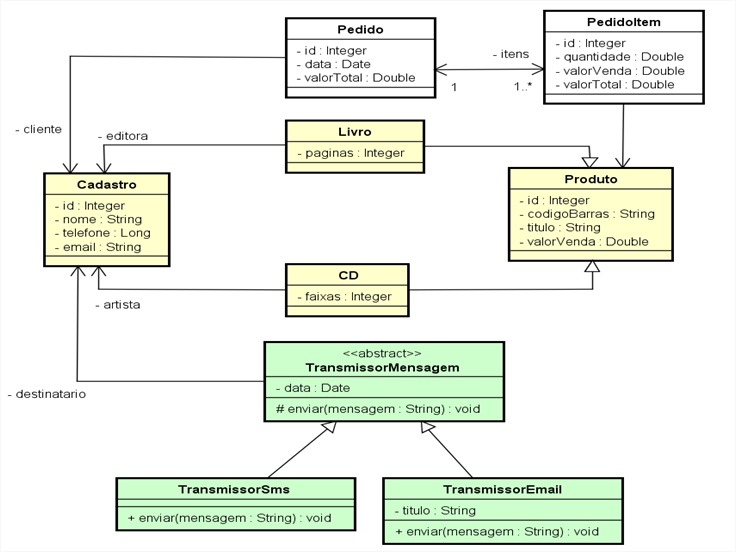

# loja
Projeto criado durante a DevShool MJV :rocket

  

Lendo o diagrama:

visibilidade dos atributos

\+ publico
\# protegido
\- privado

Livro e Cd generalizam Produto
Generalização -> possui todas as características que Produto têm, além das suas específicas.
O Relacionamento de Generalização ( “ é um tipo de ” )

TransmissorSms
sem atributos são classes “filhas” de outras [generalização], que portanto, implicitamente possuem todos os atributos que a classe “mãe” possui

Livro e Cd tem associação com Cadastro
a classe Cadastro desconhece a relação que a classe Livro e Cd tem com ela.

Multiplicidade
1..* Um ou muitos. Indica que há pelo menos um
objeto envolvido no relacionamento.